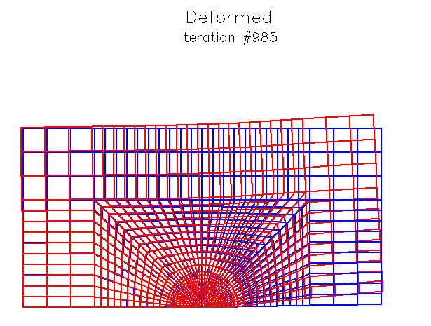

This is a FEM program based in FORTRAN, developed during the FEM Heavy course at DTU.




# Installation Guide for X11 Development Libraries and PGPLOT

---

## ✅ 1. Install X11 Development Libraries

Run the following commands on **Debian/Ubuntu** (or **WSL** on Windows):

```bash
sudo apt-get update
sudo apt-get install libx11-dev
```

This installs `libX11.so` and headers required to build X11-linked applications.

---

## ✅ 2. Install PGPLOT

### Installing PGPLOT with gfortran

```bash
# Move the PGPLOT archive to /usr/local/src
sudo mv pgplot5.2.tar.gz /usr/local/src

# Change directory to /usr/local/src
cd /usr/local/src

# Extract the tarball
sudo tar xzvf pgplot5.2.tar.gz

# Create PGPLOT installation directory
sudo mkdir /usr/local/pgplot

# Change directory to the new PGPLOT directory
cd /usr/local/pgplot

# Copy drivers.list file for editing
sudo cp /usr/local/src/pgplot/drivers.list .
```

Edit the file `drivers.list` and uncomment (remove `#` from) the following lines to enable these drivers:

```
/NULL (null device),
/PS, /VPS, /CPS, /VCPS (PostScript drivers),
/XWINDOW, /XSERVE  (X window drivers).
```

Then run:

```bash
# Prepare the makefile for Linux system with g77_gcc compiler
sudo /usr/local/src/pgplot/makemake /usr/local/src/pgplot linux g77_gcc
```

Edit the generated `makefile` and replace lines:

```makefile
FCOMPL=g77
FFLAGC=-u -Wall -fPIC -O
```

with

```makefile
FCOMPL=gfortran
FFLAGC=-ffixed-form -ffixed-line-length-none -u -Wall -fPIC -O
```

Continue installation by running:

```bash
sudo make
sudo make clean
```

Assuming your `LD_LIBRARY_PATH` points to `/usr/local/lib`, create a symbolic link:

```bash
cd /usr/local/lib
sudo ln -s /usr/local/pgplot/libpgplot.so .
```

---

### Set Environment Variables

Add the following lines to your `.bashrc` or `.bash_profile`:

```bash
# PGplot installation directory
export PGPLOT_DIR='/usr/local/pgplot'

# Default xwindow device
export PGPLOT_DEV='/xwin'

# Default white background
export PGPLOT_BACKGROUND='white'

# Default black foreground
export PGPLOT_FOREGROUND='black'

# Marking text written in PS files to be editable
export PGPLOT_PS_VERBOSE_TEXT='yes'
```

---

### Optional: Start `pgxwin_server` with 256 colors and invisible server window

```bash
/usr/local/pgplot/pgxwin_server -win_maxColors 256 -server_visible False
```

---

# End of Installation Instructions
